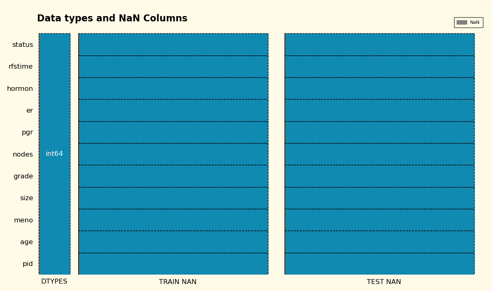
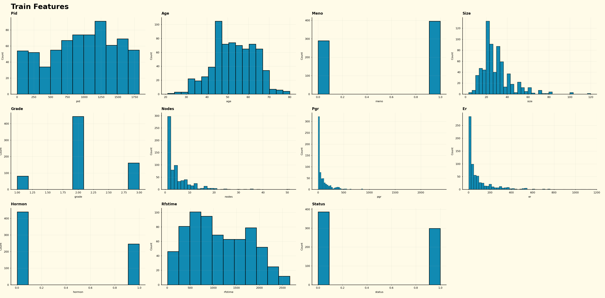
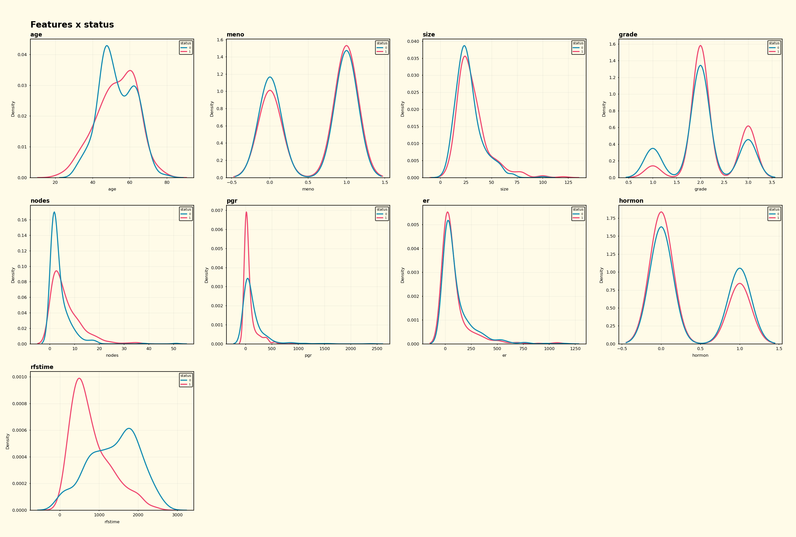
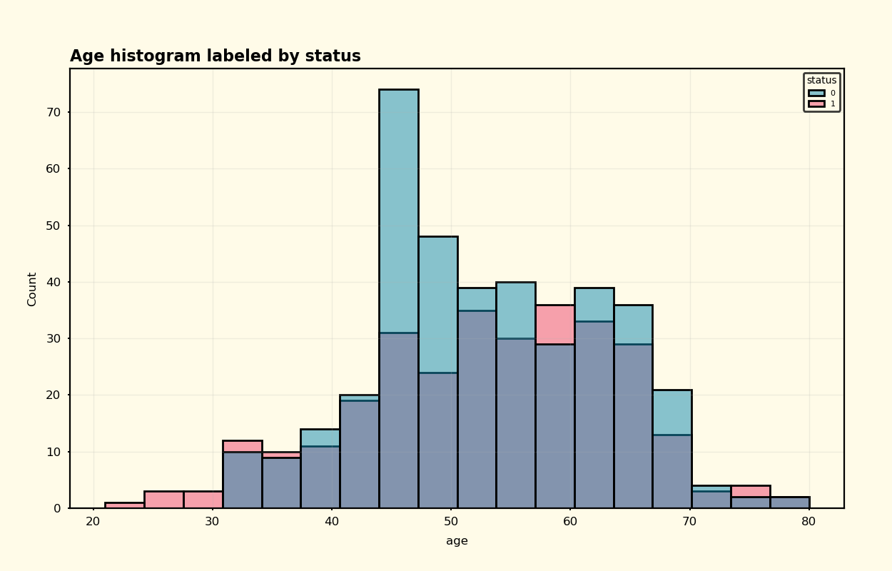
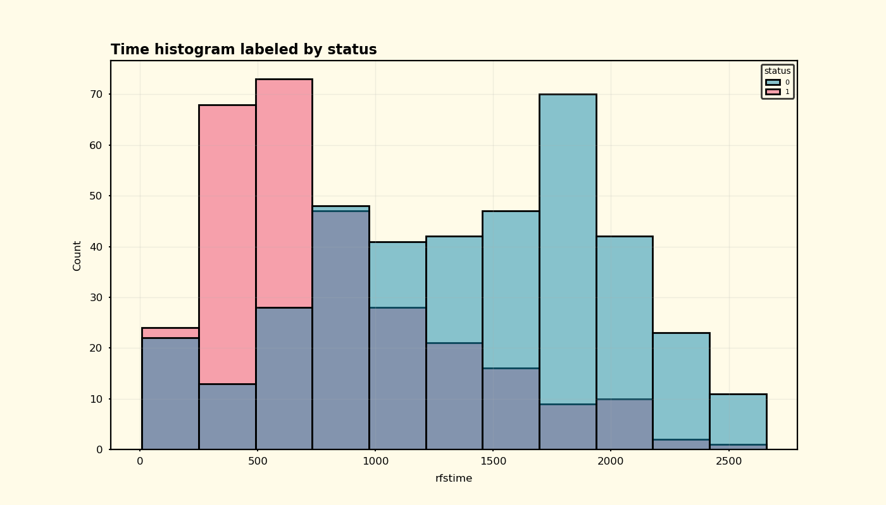

# mba_ds_project

## Exploração inicial

### Dados NaN

### Covariáveis

### Converiáveis x falha e censura

Variável de idade até ocorrência de falha ou censura

Variáveis de tempo até ocorrência de falha ou censura

## Referências

Fonte dos dados: https://www.kaggle.com/datasets/utkarshx27/breast-cancer-dataset-used-royston-and-altman

