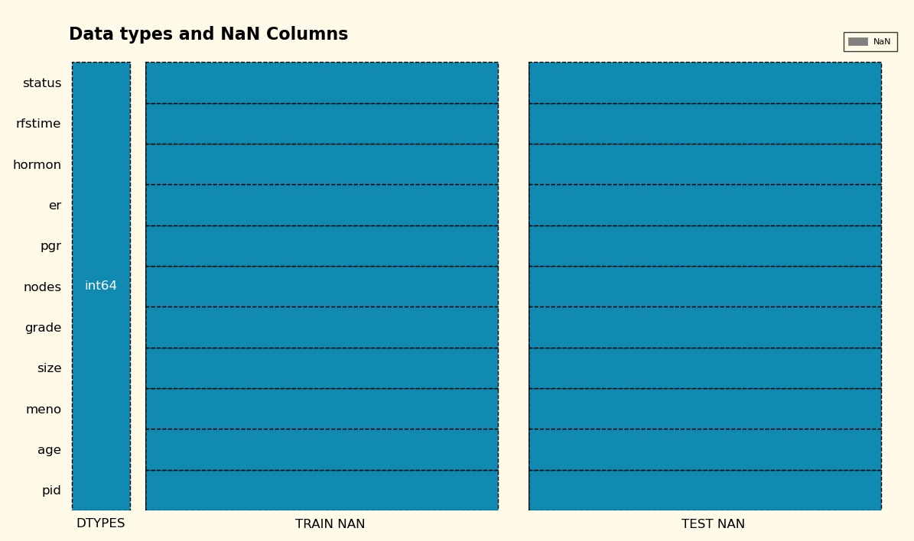
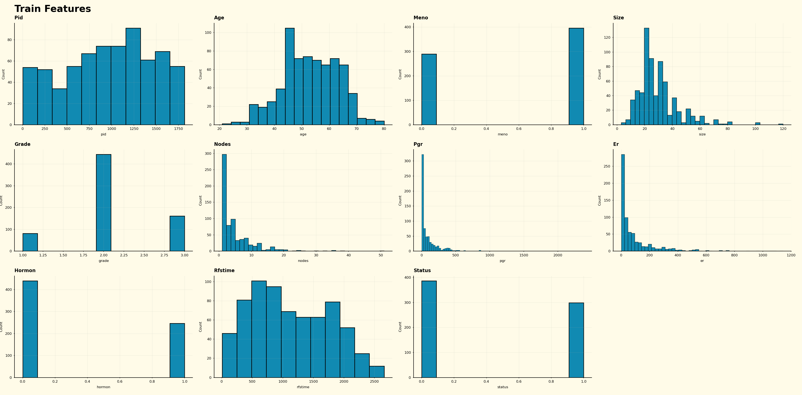
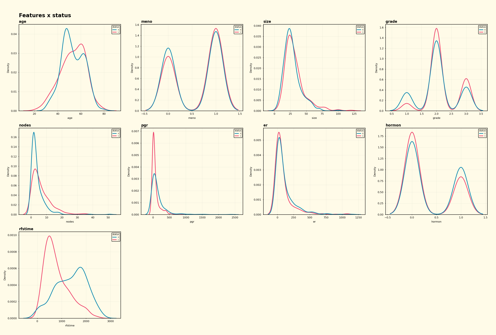
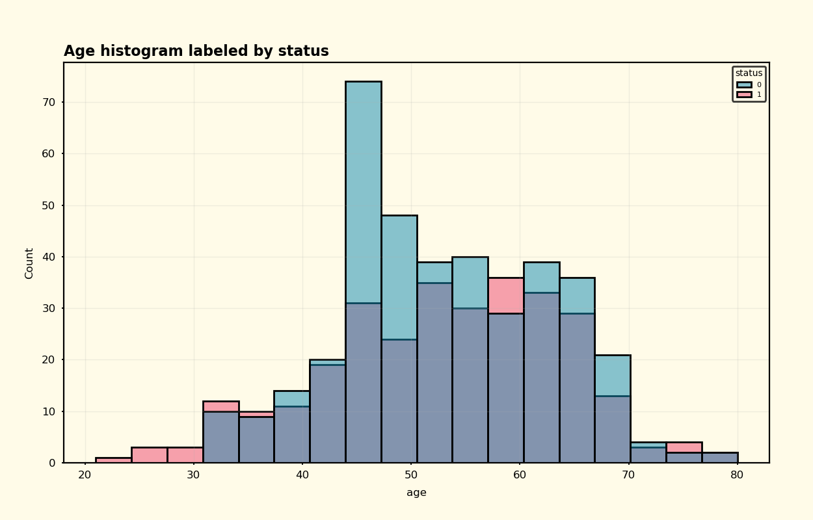
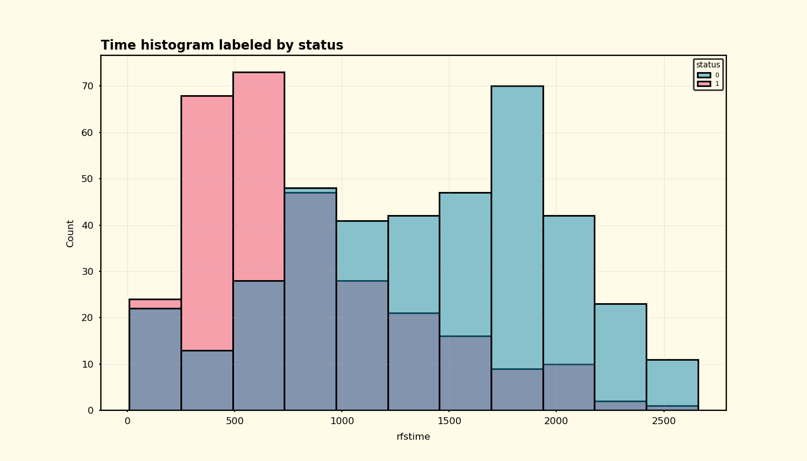

Projeto de Análise de Sobrevivência — Breast Cancer Dataset
===============================================

Descrição
---------
Projeto de análise de sobrevivência aplicado ao conjunto de dados "Breast Cancer Dataset used by Royston and Altman" (arquivo: `data/gbsg.csv`). O objetivo é explorar dados clínicos, ajustar modelos de sobrevivência (paramétricos, AFT e Cox) e comparar desempenho e adequação dos modelos.

Principais scripts e notebooks
------------------------------
- **Main:** [main.py](scripts/main.py) — Análise exploratória, visualizações (Kaplan-Meier, pirulito, KDE, comparações por grupos), ajuste de modelos paramétricos simples (Weibull, Exponential, Log-Normal), busca por melhor modelo paramétrico e ajuste de modelos de Cox.
- **Modelos paramétricos (AFT):** [model_parametric.py](scripts/model_parametric.py) — Ajuste de modelos AFT (`WeibullAFTFitter`, `LogLogisticAFTFitter`, `LogNormalAFTFitter`), validação cruzada manual (K-fold) para AIC/BIC e resumo dos resultados.
- **Univariate / spline exploration:** [univariet_parametric.py](scripts/univariet_parametric.py) — Ajustes de diversos modelos paramétricos (Weibull, Exponential, Log-Normal, Log-Logistic, Generalized Gamma, Spline) em formato univariado; exploração detalhada de modelos spline com várias localizações de nós e seleção por AIC/BIC; plots de funções de sobrevivência e hazard cumulativo.

Dados
-----
Os dados estão em `data/gbsg.csv`. As colunas principais são:
- `pid`: identificador do paciente
- `age`, `meno`, `size`, `grade`, `nodes`, `pgr`, `er`, `hormon`
- `rfstime`: tempo até evento ou censura (dias)
- `status`: indicador de evento (0 censurado, 1 evento)

Dependências
-------------
Instale as dependências Python necessárias, por exemplo:

```
pip install pandas numpy matplotlib seaborn scikit-learn lifelines
```

Execução
--------
- Abrir e executar os notebooks (`.ipynb`) no Jupyter ou VS Code para um fluxo interativo.
- Para executar os scripts principais em linha de comando:

```
python scripts/main.py
python scripts/model_parametric.py
python scripts/univariet_parametric.py
```

Saídas
------
- Várias figuras e artefatos são salvos na pasta `images/` (criada pelos scripts) — por exemplo: curvas de sobrevivência, QQ-plots, comparações entre modelos e heatmaps de features.

Notas rápidas
------------
- Os scripts usam a biblioteca `lifelines` para ajuste e avaliação de modelos de sobrevivência.
- Alguns modelos (e plots, p.ex. QQ-plot) podem não estar implementados para todas as classes de modelo; os scripts tratam exceções e informam quais modelos suportam cada verificação.

Licença
-------
Uso acadêmico/educacional

<!-- ## Exploração inicial

### Dados NaN



### Covariáveis



### Converiáveis x falha e censura


Variável de idade até ocorrência de falha ou censura


Variáveis de tempo até ocorrência de falha ou censura


## Referências -->

<!-- Fonte dos dados: https://www.kaggle.com/datasets/utkarshx27/breast-cancer-dataset-used-royston-and-altman -->

